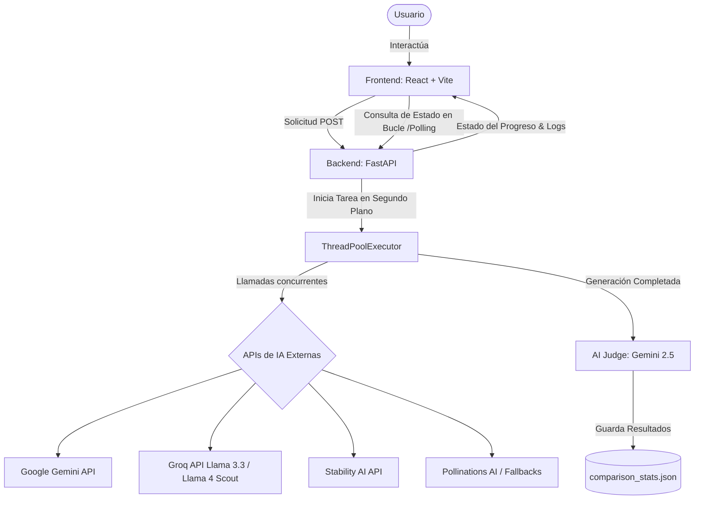

# ⚔️ Antigravity Arena: Comparador de Modelos Pro ⚔️

Una plataforma avanzada e interactiva de benchmarking y duelos en tiempo real entre los modelos de Inteligencia Artificial más potentes del mercado (Google Gemini, OpenAI GPT-4o, Stability AI, Google Imagen, entre otros). Esta aplicación permite a los usuarios contrastar respuestas en múltiples modalidades (Texto, Visión y Generación Visual) mediante una interfaz interactiva premium de tema oscuro, un sistema de votación global con estadísticas en vivo y un sofisticado **Juez de Inteligencia Artificial** para evaluar los resultados objetivamente.

---

## 🚀 Características Principales

La aplicación se compone de tres módulos interactivos principales (Duelos), además de paneles de analíticas y automatizaciones de IA:

### 1. 📝 Duelos de Texto (Text Duels)
* **Modelos en Combate**: `Google Gemini 2.5 Flash` vs. `Groq Llama 3.3 (llama-3.3-70b-versatile)`.
* **Personalización Avanzada**: Permite ajustar la idea base (prompt), el tipo de formato (Cuento, Poema, Marketing, etc.), el estilo/nicho (Fantasía, Ciencia Ficción, Marketing) y la extensión de palabras a través de un slider interactivo.
* **Juez de IA Integrado**: Evalúa de manera automática con un prompt estructurado usando Gemini para puntuar del 1 al 10 las respuestas de ambos modelos en base a su coherencia, estilo y apego a las instrucciones del usuario.

### 2. 👁️ Duelos de Visión (Multimodal)
* **Modelos en Combate**: Comparación detallada de análisis de imagen utilizando `Google Gemini 2.5 Flash` vs. `Groq Llama 4 Scout (meta-llama/llama-4-scout-17b-16e-instruct)`.
* **Interacción**: Los usuarios pueden subir una imagen (JPEG/PNG/WebP) y realizar preguntas o peticiones de análisis específicas.
* **Evaluación**: Contraste inmediato de la precisión analítica, detección de objetos y adherencia a detalles sutiles de la imagen por parte de ambos modelos.

### 3. 🎨 Duelos de Creación Visual (Imágenes y Videos)
* **Generación de Imágenes**: Duelos de alta calidad visual entre **Stability AI (Stable Image Ultra)** vs. **Google Imagen (Imagen 3)**, con **Pollinations AI** como fallback gratuito e inteligente.
* **Generación de Videos**: Animación fluida de escenas comparando **Stability Video (SVD)** contra el motor de **A2E Video Generator**.
* **Configuración Visual**: Soporta selección de múltiples relaciones de aspecto (`1:1`, `16:9`, `4:3`, `21:9`) y estilos artísticos prediseñados.
* **Juez Multimodal**: Gemini Vision analiza ambas imágenes o videos generados de forma automática, otorgando puntajes independientes y explicando estéticamente cuál capturó mejor el prompt original en inglés/español.

### 4. 📊 Votación, Gráficos Interactivos y Estadísticas Globales
* **Voto Ciego y Revelado**: Los usuarios pueden votar por el modelo izquierdo o derecho después de cada duelo para alimentar un tablero global.
* **Dashboard Estadístico Interactivo (Chart.js)**: Gráficos de alta fidelidad que visualizan la cuota de participación por proveedor, niveles de actividad por arena, tasa de victoria (win rates) y evolución cronológica.
* **Gráfico de Radar / Araña en Duelos**: Visualización dinámica de 5 dimensiones críticas de adherencia al prompt y calidad narrativa/visual directamente en la tarjeta de evaluación del duelo.
* **Historial de Duelos**: Registro local interactivo de los duelos previos generados durante la sesión.

---

## 🏗️ Arquitectura y Flujo del Sistema

El proyecto está diseñado bajo una arquitectura desacoplada de alto rendimiento:



### Flujo del Procesamiento Asíncrono (Polling)
1. El usuario inicia una solicitud de duelo desde React.
2. El backend de FastAPI registra una tarea asíncrona mediante un `ThreadPoolExecutor` (máximo de 5 workers simultáneos) y devuelve un `task_id` instantáneo.
3. El frontend de React recibe el ID e inicia un sondeo (polling) cada 2 segundos a `/api/generate/status/{task_id}`.
4. El backend va actualizando progresivamente el porcentaje de carga y mensajes específicos del estado (`"Generando con OpenAI..."`, `"Ejecutando Juez de IA...",` `"Guardando estadísticas..."`).
5. Al completarse, el frontend renderiza la interfaz de manera fluida y sin bloqueos de red o tiempos de espera (timeouts).

---

## 📂 Estructura del Proyecto

```bash
proyecto/
├── Generador-de-contenido/    # --- BACKEND (FastAPI) ---
│   ├── src/
│   │   ├── config.py                 # Gestión de variables de entorno y constantes
│   │   ├── ai_judge.py               # Lógica del Juez automático usando Gemini
│   │   ├── text_generator.py         # Conectores para generación de texto
│   │   ├── image_generator.py        # Generación de imágenes (Stability / Google / Pollinations)
│   │   ├── vision_generator.py       # Análisis multimodal
│   │   └── stats_manager.py          # Gestión y lectura del archivo de estadísticas
│   ├── static/                       # Archivos estáticos generados (imágenes, videos)
│   ├── app.py                        # Puntos de entrada de la API de FastAPI
│   ├── requirements.txt              # Dependencias de Python
│   ├── .env.example                  # Plantilla de configuración de credenciales
│   └── comparison_stats.json         # Base de datos local en JSON para votos y registros
│
├── front_generate/            # --- FRONTEND (React + Vite) ---
│   ├── src/
│   │   ├── App.jsx                   # Componente principal interactivo de la Arena (50KB+)
│   │   ├── StatsCharts.jsx           # Gráficos interactivos de estadísticas globales (Chart.js)
│   │   ├── EvaluationChart.jsx       # Gráficos de radar/araña para evaluación detallada de duelos
│   │   ├── App.css                   # Estilizado personalizado premium
│   │   ├── main.jsx                  # Inicializador de React
│   │   └── index.css                 # Diseño base y variables del sistema de diseño
│   ├── package.json                  # Dependencias del Frontend
│   └── vite.config.js                # Configuración de compilación y servidor Vite
│
├── package.json               # Dependencias de gestión raíz
├── run.sh                     # Script Bash de ejecución unificada de servidores
└── README.md                  # Este archivo de documentación
```

---

## 🔧 Requisitos Previos

Antes de comenzar, asegúrate de tener instalado en tu sistema:
* **Python 3.11 o superior**
* **Node.js 18 o superior** y **npm**
* Acceso a internet y las API keys correspondientes para los servicios que desees probar (mínimo recomendado: `GEMINI_API_KEY`).

---

## 🛠️ Instalación y Configuración Paso a Paso

### 1. Clonar el repositorio
Entra en la carpeta del proyecto en tu terminal.

### 2. Configurar el Backend (Python + FastAPI)
Accede al directorio del backend:
```bash
cd Generador-de-contenido
```

Crea y activa un entorno virtual de Python:
* **En Linux/macOS:**
  ```bash
  python3 -m venv venv
  source venv/bin/activate
  ```
* **En Windows:**
  ```bash
  python -m venv venv
  venv\Scripts\activate
  ```

Instala las dependencias necesarias:
```bash
pip install -r requirements.txt
```

Crea tu archivo de variables de entorno `.env` a partir de la plantilla:
```bash
cp .env.example .env
```

Edita el archivo `.env` recién creado e introduce tus credenciales correspondientes:
```env
GEMINI_API_KEY=tu_api_key_de_gemini
GEMINI_TEXT_MODEL=gemini-2.5-flash
GROQ_API_KEY=tu_api_key_de_groq
GROQ_TEXT_MODEL=llama-3.3-70b-versatile
GROQ_VISION_MODEL=meta-llama/llama-4-scout-17b-16e-instruct
STABILITY_API_KEY=tu_api_key_de_stability_opcional
A2E_API_KEY=tu_api_key_de_a2e_opcional
```

Regresa a la raíz del proyecto:
```bash
cd ..
```

### 3. Configurar el Frontend (React + Vite)
Accede al directorio del frontend:
```bash
cd front_generate
```

Instala todos los paquetes de Node:
```bash
npm install
```

Regresa a la raíz del proyecto:
```bash
cd ..
```

---

## ⚡ Ejecución en un solo paso

Para hacer el desarrollo extremadamente cómodo, el proyecto incluye un script unificado de ejecución llamado `run.sh` en la raíz del proyecto. Este script se encarga de:
1. Iniciar el servidor backend de FastAPI en `http://127.0.0.1:8000`.
2. Activar el entorno virtual automáticamente si existe.
3. Levantar el servidor de desarrollo de Vite para el frontend de React.
4. Escuchar interrupciones del teclado (`Ctrl+C`) para apagar de forma limpia ambos servidores de manera simultánea sin dejar procesos huérfanos.

Para ejecutar la aplicación simplemente corre:
```bash
chmod +x run.sh   # (Solo la primera vez para dar permisos de ejecución en Linux/Mac)
./run.sh
```

Abre en tu navegador la URL provista por Vite en pantalla (usualmente `http://localhost:5173`). ¡Y estarás listo para iniciar los duelos de IA!

---

## 🤖 ¿Cómo funciona el Juez de IA (AI Judge)?

Una de las características más avanzadas del proyecto es el archivo `ai_judge.py`, que automatiza la evaluación de rendimiento de los modelos en texto e imágenes de manera objetiva:

* **Para Duelos de Texto**:
  Envía el prompt original, el texto generado por el Modelo A y el del Modelo B a Gemini 2.5 Flash con una instrucción de sistema muy estricta. Gemini evalúa la fidelidad temática, el formato, la coherencia gramatical y la riqueza de vocabulario de ambos textos, devolviendo una puntuación estructurada en formato JSON junto con un análisis crítico en español de 3 líneas.

* **Para Duelos de Imagen**:
  Envía ambas imágenes generadas en binario a Gemini Vision. El juez analiza la composición artística, el realismo o estilo solicitado, la resolución aparente, los artefactos visuales y el apego al prompt literal del usuario. Evalúa de forma inteligente si un modelo usó fallbacks por falta de API keys para calibrar los puntajes de manera justa.

---

## 📄 Licencia

Este proyecto es para uso educativo, experimental y benchmarking de modelos de IA de última generación.

---

*Desarrollado con pasión para comparar la vanguardia de la IA. ¡Que comience el duelo en la Arena Antigravity!* 🚀⚔️